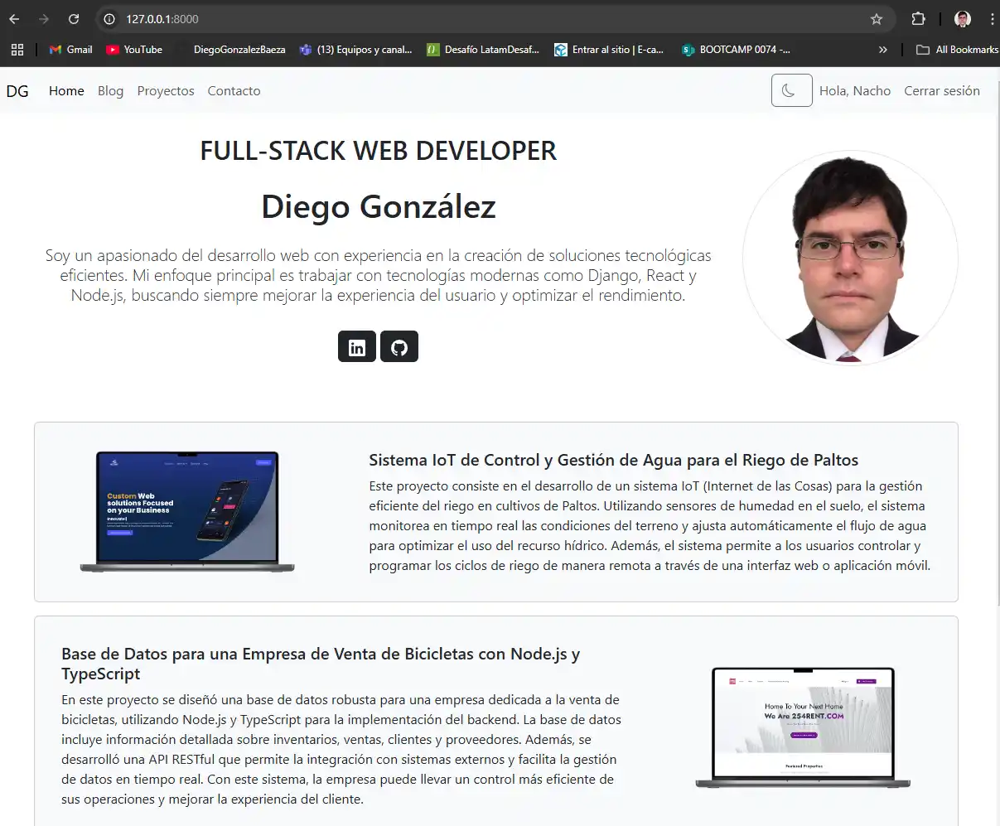

# Sistema de Portafolio Web Personal

## Contexto

En un mundo digital cada vez más competitivo, tener una presencia en línea sólida es esencial para destacar y generar un impacto significativo. Este proyecto tiene como objetivo desarrollar una plataforma web integral que permita gestionar y mostrar de manera eficiente los contenidos relacionados con tu marca personal. La solución incluye funcionalidades de blog, contacto, autenticación de usuarios, manejo de errores y gestión de proyectos. Esta plataforma será el centro de tu presencia digital, permitiéndote mostrar tus logros y conectar con tu audiencia.

## Descripción del Proyecto

El **Sistema de Portafolio Web Personal** es una plataforma construida con **Django**, **Python**, **HTML**, **CSS**, y **JavaScript**, diseñada para ayudar a los usuarios a crear y gestionar su portafolio personal en línea. La plataforma incluye las siguientes aplicaciones:

- **Blog**: Un blog personal para compartir publicaciones relevantes de tu carrera y marca personal.
- **Contacto**: Un formulario para que los visitantes puedan enviarte mensajes directamente desde el sitio.
- **Accounts**: Un sistema de autenticación para permitir a los usuarios registrarse, iniciar sesión y acceder a su panel personal.
- **Error**: Manejo de errores con páginas de error personalizadas, como el error 404.
- **Home**: Página principal del sitio con elementos clave como proyectos y publicaciones destacadas.
- **Proyectos**: Gestión y presentación de proyectos personales o profesionales, accesibles solo para usuarios autenticados.

## Estructura del Proyecto

El proyecto se organiza de la siguiente manera:

- **portafolioPersonal0074**: Carpeta principal que almacena el proyecto.
- **portafolio**: Nombre del proyecto Django.
- **blog, contacto, accounts, error, home, proyectos**: Aplicaciones que forman parte del proyecto.

## Requisitos

1. **Estructura de Archivos y Templates**:
   - **base.html**: Archivo base para la estructura común de todas las páginas (encabezado, pie de página, etc.).
   - **Base de Datos**: PostgreSQL para la gestión robusta de datos.
   - **Includes**: Secciones reutilizables como el menú de navegación se encuentran en la carpeta `includes`.
   - **Archivos Estáticos**: Archivos CSS, imágenes y JavaScript almacenados en la carpeta `static`.

2. **Desarrollo de las Aplicaciones**:
   - **Blog**: Incluye un modelo `Post` con campos como título, contenido, fecha de publicación y autor. Permite listar y detallar publicaciones.
   - **Contacto**: Formulario para que los usuarios envíen mensajes, con validaciones y vista de confirmación.
   - **Accounts**: Implementa autenticación con Django (registro, inicio de sesión, panel personal).
   - **Error**: Páginas de error personalizadas (por ejemplo, error 404).
   - **Home**: Página principal que presenta proyectos y publicaciones destacadas.
   - **Proyectos**: Gestión de proyectos personales o profesionales, con funcionalidades de CRUD para usuarios autenticados.

3. **Autenticación y Gestión de Usuarios**:
   - Sistema de autenticación integrado con Django (registro, inicio de sesión, panel personal).

4. **Interfaz de Usuario**:
   - Diseño moderno y responsivo utilizando **HTML**, **CSS** y **JavaScript**. 
   - Uso de **Bootstrap** para garantizar una interfaz accesible desde cualquier dispositivo.

5. **Base de Datos**:
   - Uso de **PostgreSQL** como base de datos para todas las aplicaciones.

6. **Administración**:
   - Gestión de los modelos (Post, Contacto, Proyectos, Cuentas) desde el panel de administración de Django.

## Instalación

### Requisitos previos
1. Python 3.x
2. PostgreSQL instalado y configurado
3. Instalación de requirements

## Instalación de dependencias.

requirements.txt
```txt
asgiref==3.8.1
Django==5.1.5
django-bootstrap5==24.3
psycopg2==2.9.10
sqlparse==0.5.3
tzdata==2025.1
```

```bash
pip install -r requirements.txt
```

```Python
from django.shortcuts import render, get_object_or_404, redirect
from django.contrib.auth.decorators import login_required
from .models import Proyecto
from .forms import ProyectoForm

# Create your views here.
@login_required
def lista_proyectos(request):
    proyectos = Proyecto.objects.filter(creado_por=request.user)
    return render(request, 'proyectos/proyectos.html', {'proyectos': proyectos})

@login_required
def proyecto_detalle(request, proyecto_id):
    proyecto = get_object_or_404(Proyecto, id=proyecto_id)
    return render(request, 'proyectos/proyecto_detalle.html', {'proyecto': proyecto})

@login_required
def proyecto_create(request):
    if request.method == 'POST':
        form = ProyectoForm(request.POST)
        if form.is_valid():
            proyecto = form.save(commit=False)
            proyecto.creado_por = request.user
            proyecto.save()
            return redirect('proyectos')
    else:
        form = ProyectoForm()
    return render(request, 'proyectos/proyectos_form.html', {'form': form})

@login_required
def proyecto_update(request, proyecto_id):
    proyecto = get_object_or_404(Proyecto, id=proyecto_id, creado_por=request.user)
    if request.method == 'POST':
        form = ProyectoForm(request.POST, instance=proyecto)
        if form.is_valid():
            form.save()
            return redirect('proyectos')
    else:
        form = ProyectoForm(instance=proyecto)
    return render(request, 'proyectos/proyectos_form.html', {'form': form})

@login_required
def proyecto_delete(request, proyecto_id):
    proyecto = get_object_or_404(Proyecto, id=proyecto_id, creado_por=request.user)
    if request.method == 'POST':
        proyecto.delete()
        return redirect('proyectos')
    return render(request, 'proyectos/proyectos_confirm_delete.html', {'proyecto': proyecto})
```
## CRUD Proyectos

```python
from django import forms
from .models import Proyecto

class ProyectoForm(forms.ModelForm):
    class Meta:
        model = Proyecto
        fields = ['titulo', 'descripcion', 'fecha_de_inicio', 'fecha_de_finalizacion', 'estado_actual']
        widgets = {
            'titulo': forms.TextInput(attrs={'class': 'form-control', 'placeholder': 'Título del proyecto'}),
            'descripcion': forms.Textarea(attrs={'class': 'form-control', 'placeholder': 'Descripción del proyecto'}),
            'fecha_de_inicio': forms.DateInput(attrs={'class': 'form-control', 'type': 'date'}),
            'fecha_de_finalizacion': forms.DateInput(attrs={'class': 'form-control', 'type': 'date'}),
            'estado_actual': forms.Select(attrs={'class': 'form-control'}),
        }
```

## Settings.py

DEBUG = False, si se desea , en trabajar en desarrollo se debe cambia a True

```python
DEBUG = False

ALLOWED_HOSTS = ['127.0.0.1', 'localhost', ' http://127.0.0.1:8000/', 'http://', '8000', 'http://127.0.1/']


# Application definition

INSTALLED_APPS = [
    'django.contrib.admin',
    'django.contrib.auth',
    'django.contrib.contenttypes',
    'django.contrib.sessions',
    'django.contrib.messages',
    'django.contrib.staticfiles',
    'django_bootstrap5',
    'blog',
    'contacto',
    'accounts',
    'error',
    'home',
    'proyectos',
]

DATABASES = {
    'default': {
        'ENGINE': 'django.db.backends.postgresql',
        'NAME': 'PortafolioDB',
        'USER': 'postgres',
        'PASSWORD': 'root',
        'HOST': 'localhost',
        'PORT': '5432',
    }
}
```

## IMAGENES FUNCIONALIDAD: 




